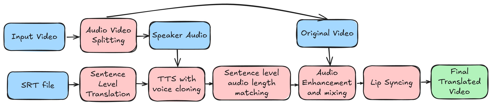

<p align="center">
  <a href="https://colab.research.google.com/drive/1e_Y3i8Q9ECnnM8DAWBoayZwtPyi99LGA">
    
  </a>
</p>

# Video Translation 
This library performs video translation from English to German. Currently it requires a subtitle file to be provided for the input video. The following packages are used - 
- Text translation = <a href="https://huggingface.co/Helsinki-NLP/opus-mt-en-de" target="_blank">opus-mt-en-de</a>
- TTS = <a href="https://github.com/idiap/coqui-ai-TTS" target="_blank">coqui tts</a>
- Lip Sync = <a href="https://github.com/ByteDance/LatentSync" target="_blank">LatentSync</a>

## Table of Contents
- [Setup](#setup)
- [Usage](#usage)
- [Sample outputs](#sample-outputs)
- [Pipeline Overview](#pipeline-overview)
- [Assumptions and Limitations](#assumptions-and-limitations)

## Setup
Download and installation
```
sudo apt install espeak-ng
git clone https://github.com/Sambhav300899/VideoTranslation.git
git submodule update --init --recursive
cd VideoTranslation
uv pip install -e .
uv pip install -r requirements.txt
```

Download checkpoints for LatentSync
```
hf download ByteDance/LatentSync-1.5 whisper/tiny.pt --local-dir LatentSync/checkpoints
hf download ByteDance/LatentSync-1.5 latentsync_unet.pt --local-dir LatentSync/checkpoints
```
## Usage

To launch the Gradio demo, use the following command:
```
python gradio_demo.py
```

Alternatively, you can use the following command to translate a video:

```
python run_translation.py --i <input_video_path> --o <output_video_path> --srt <subtitle_path> --tts <tts_model> --use_lipsync <use_lipsync> --enhance_audio <enhance_audio>

# Sample command
python run_translation.py --i sample_data/Tanzania-2.mp4 --o sample_data/Tanzania-2_translated.mp4 --srt sample_data/Tanzania-caption.srt --tts xtts_v2 --use_lipsync True --enhance_audio True
```

## Sample outputs

### Tacotron2 TTS 

<table>
<tr>
<td width="33%">

Original
---
https://github.com/user-attachments/assets/5331de54-a52a-4ab4-9b71-d2b4fd914dc4
</td>
<td width="33%">

Dubbed
---
https://github.com/user-attachments/assets/107ee213-586e-4d4d-9d72-a0306c92adf6
</td>

<td width="33%">

Lipsync
---
https://github.com/user-attachments/assets/ca3adec6-5179-4e28-b92c-a365f466a7d8
</td>

</tr>
</table>

### XTTS_v2 TTS
<table>
<tr>
<td width="33%">

Original
---
https://github.com/user-attachments/assets/5331de54-a52a-4ab4-9b71-d2b4fd914dc4
</td>
<td width="33%">

Dubbed
---


https://github.com/user-attachments/assets/b89298fb-4dd4-4b35-ad15-9b9be4b19ead


</td>

<td width="33%">

Lipsync
---


https://github.com/user-attachments/assets/864659b0-7562-482a-859b-b35da1e267da


</td>

</tr>
</table>


## Pipeline Overview


The pipeline follows the following steps - 
1.  **Subtitle Processing**: The subtitle file is used for sentence-level splitting and extracting desired audio lengths for each sentence.
2.  **Text Translation**: Subtitle sentences are translated to German using the `opus-mt-en-de` model.
3.  **Audio Generation**: The TTS model generates audio for each translated sentence, using the original video's audio as the cloning target.
4.  **Audio Length Adjustment**: Audio length for each sentence segment is adjusted to match the original video.
5.  **Audio Enhancement**: Individual sentence audio segments are combined and enhanced.
6.  **Lip Sync Generation**: The `LatentSync` model generates lip sync for the translated video based on the generated TTS audio.


## Assumptions and Limitations
1.  **Subtitle Dependency**: Currently requires a provided subtitle file, lacking integrated Automatic Speech Recognition (ASR) for automatic subtitle extraction.
2.  **Language Specificity**: Limited to English-to-German translation due to the chosen translation model (`opus-mt-en-de`).
3.  **Single Speaker Assumption**: The Text-to-Speech (TTS) `xtts_v2/tacotron2` component assumes a single speaker; multi-speaker videos may lead to incorrect voice cloning or synthesis.
4.  **Lip Sync Performance Overhead**: The `LatentSync` model is computationally intensive and leads to degradation in overall audio and video quality.
5.  **Lack of Evaluation Metrics**: There are no objective metrics currently employed to evaluate the quality of the translated video, which makes the selection of TTS and Lip Sync models somewhat arbitrary. I'm currently using the absolute difference between the original and translated audio as a proxy metric.
6.  **Contextual Translation Limitations**: Sentence-level translation may lead to a loss of overall context. A potential improvement involves using Large Language Models (LLMs) with in-context learning for more coherent translation.
7.  **Audio Flow Issues**: Sentence-level audio length timing adjustments might result in an unnatural or disrupted audio flow.
8.  **Open-Source Lip Sync Quality**: The quality of available open-source Lip Sync models is not the greatest.
